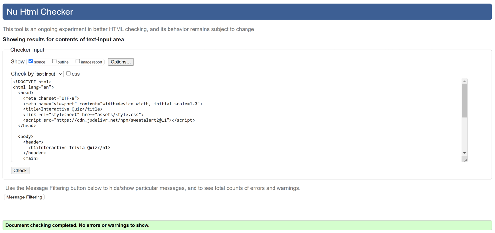
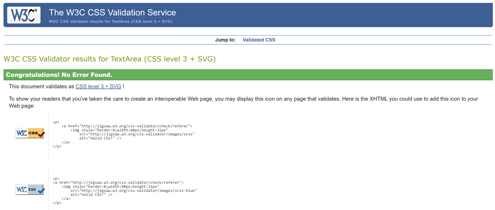
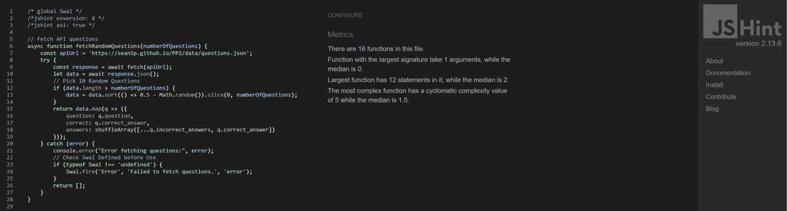

# Interactive Trivia Quiz

## Introduction

This Interactive Trivia Quiz is a web-based application designed to offer users an engaging way to test their general knowledge in various fields such as sports, movies, literature, and personality assessments. Hosted via GitHub Pages, this project aims to provide a fun and educational experience for users, while also showcasing modern web development practices including responsive design, interactivity, and accessibility.

### Portfolio Project 2 – Sean Kirwan

! [Multi-Screen Image](assets/images/pp2-multiscreenview1.png)

[Project Repository](https://github.com/sean5p/PP2-TEST-Interactive-Quiz.git)

[Live Site](https://sean5p.github.io/PP2-TEST-Interactive-Quiz/)

## Table of contents

1. [UX](#ux)
2. [Features](#features)
3. [Technology Used](#technology)
4. [Accessibility Features](#accessibility)
5. [Testing](#testing)
6. [Deployment](#deployment)
7. [Credits](#credits)
8. [Acknowledgements](#acknowledge)

## <a name="ux">UX</a>

### How to Use
To play the quiz:
1. Visit [Interactive Quiz](https://sean5p.github.io/PP2-TEST-Interactive-Quiz/)
2. Read the displayed question and select your answer.
3. Click on "Submit Answer" to proceed to the next question.
4. After the last question, your score will be displayed.
5. Click "Restart" to play again with a new set of questions.

### User Stories for "Interactive Trivia Quiz"

##### Users:
•	I want to test my knowledge on various topics through an engaging quiz format.
•	I'm looking for a quick and entertaining way to challenge myself intellectually.
•	I desire a user-friendly platform that tracks my progress throughout the quiz.
•	I seek instant feedback on my answers to learn and improve.
•	I wish to have a diverse range of questions for a varied quiz experience each time.

##### Site Owner:

•	I aim to provide an educational and entertaining quiz experience for users.
•	I wish to offer a platform that's easy to navigate and use.
•	I aspire to make the quiz diverse and engaging with a wide range of questions.
•	I want to encourage repeated visits to the quiz by offering a unique set of questions for each session.

### Scope

The website will:
•	Offer a straightforward and intuitive user interface for an enjoyable quiz experience.
•	Present a selection of randomly chosen questions each session to keep the quiz fresh and engaging.
•	Provide immediate feedback on user answers for an interactive learning experience.
•	Include a progress tracker showing the current question number (e.g., "Question 3 of 10").
•	Display the user's score at the end of each quiz session.
•	Feature a responsive design for compatibility across various devices and screen sizes.
•	Allow users to restart the quiz for a new set of questions.

### Structure

#### Home Page
•	Header: Featuring the title "Interactive Trivia Quiz" and a brief introduction.
•	Main Content:
•	A section displaying the current question and multiple-choice answers.
•	A progress indicator showing the current question number.
•	Interactive Elements:
•	Buttons for submitting answers and moving through the quiz.
•	Dynamic feedback display after each question.
•	Footer:
•	A score summary at the end of the quiz.
•	A "Restart" button to initiate a new quiz session.

### Surface
Aim is to create a Simple, yet Attractive Interface.

#### Background Color
•	Primary Background: Is a linear gradient from #6a11cb (a deep blue) to #2575fc (a bright blue) to create a dynamic and engaging background.
•	Secondary Background: Is semi-transparent white (rgba(255, 255, 255, 0.8)) for the quiz container, as it provides a clear and legible quiz content area, ensuring good readability against a vibrant background.

#### Font Color
•	Primary Font: Is font color (#333, a dark gray/black) with excellent readability, especially for the main text elements on the lighter background of the quiz container.
•	Secondary Font: Is white (#fff) and used effectively in headers and footers to provides excellent contrast against the darker gradient background and is also easy on the eyes.

#### Fonts
•	Fonts: Arial is used as it's a widely available, web-safe font known for its readability.

## <a name="features">Features</a>

### Existing Features
- **Dynamic Question Loading**: Questions are fetched from an external API and presented to the user one at a time.
- **Random Question Selection**: Each session randomly picks 10 questions, ensuring a unique experience every time.
- **Instant Feedback**: After each answer submission, instant feedback is provided, indicating whether the answer was correct or incorrect. 
- **Score Tracking**: Scores are tracked throughout the quiz, and displays final score at the end of the session.
- **User Interaction**: The quiz offers interactive elements like buttons and input fields optimised for both desktop and mobile devices.
- **Responsive Design**: Designed with a mobile-first approach, ensuring usability and aesthetics on smartphones and other devices.
- **Accessibility**: Implements simple high-contrast colours and readable fonts to cater to a wide range of users, including those with visual impairments.

### Future Features

Over the next year (time permitting), I intend on adding some / most / all of the following features:
1.	Source Control / Flexibility: Ability to Automatically Fetch Questions from Alternative Sources if Default Fails within set timeframe.  
2.	Category Selection: So users can choose from various categories or topics for their quiz (i.e., general knowledge, history, science, pop culture, etc).
3.	Difficulty Levels: So users can choose different difficulty levels according to their comfort and knowledge level (i.e., easy, medium, hard).
4.	Timed Quizzes: To introduce a time limit for each question or the entire quiz to add a sense of urgency and challenge.
5.	Leaderboard and User Accounts: Implement a leaderboard to display high scores. Allow users to create accounts to track their progress over time.
6.	Social Sharing: Enable users to share their scores on social media platforms, encouraging competition and engagement.
7.	Quiz Customisation: So users can create their own quizzes by submitting questions, which can be moderated and added to the quiz database.
8.	Adaptive Learning: Implement an algorithm that adapts the difficulty of questions based on the user’s previous answers.
9.	Interactive Elements: Add elements like progress bars, animations, and sound effects for correct or incorrect answers to enhance user engagement.
10.	Feedback and Explanation: Provide detailed explanations for answers, so users can learn more about the topic.
11.	Multimedia Questions: Incorporate images, audio, and video clips into questions to make the quiz more dynamic and engaging.
12.	Multiplayer Mode: Create a mode where users can compete against friends or random players online in real-time.
13.	Language Support: Offer the quiz in multiple languages to attract a broader audience.
14.	Accessibility Features: Ensure the quiz is accessible to all users, including those with disabilities, by adhering to web accessibility standards.
15.	Mobile App: Develop a mobile application for the quiz for greater accessibility and offline capability.
16.	Regular Updates: Continuously update the quiz with new questions and features based on user feedback and trends.
17.	Educational Partnerships: Collaborate with businesses and educational institutions to create specialised quizzes for compliance, training, and educational purposes.
18.	Achievements and Rewards: Implement a system of achievements or rewards that users can unlock by completing specific challenges.

These features should significantly enhance user experience and make the Quiz a more robust and engaging platform.

## <a name="technology">Technology Used</a>

The following technologies work together to create an interactive and user-friendly web-based trivia quiz

### HTML (HyperText Markup Language):
Used for structuring the content on the web page.

### CSS (Cascading Style Sheets):
Used to style the HTML content.

### JavaScript:
Used to handle quiz logic, such as fetching questions, processing user input, keeping track of scores, and dynamically updating the HTML content based on user interactions.

### SweetAlert2:
Is a JavaScript library used to create beautiful, responsive, and customisable replacement popups to the default browser dialog boxes, alerts and feedback to the user (e.g., correct or incorrect answers, quiz completion, etc.).

### JSON (JavaScript Object Notation):
A data-interchange format to store and transport the quiz questions and answers (as seen in questions.json).

### GitHub Pages:
Used for hosting the web application. GitHub Pages is a static site hosting service that takes HTML, CSS, and JavaScript files directly from a GitHub repository and publishes a website.

## <a name="accessibility">Accessibility Features</a>

* All images have alt labels
* Any links that take user to external website have aria labels
* Care has been taken to ensure good contrast between text and back ground colors
* Have used semantic html throughout

## <a name="testing">Testing</a>

### Functional Testing

Extensive functional testing was conducted to ensure every part of the trivia quiz operates as expected. The following tests were performed:

| Test                                              | Outcome |
|---------------------------------------------------|---------|
| Navigation through quiz questions works correctly | PASS    |
| Questions are loaded and displayed correctly      | PASS    |
| Answer selection and submission function properly | PASS    |
| Progress counter updates correctly per question   | PASS    |
| Quiz score is calculated and displayed at the end | PASS    |
| Quiz restart functionality works as intended      | PASS    |
| Responsive design on various screen sizes         | PASS    |

### User Testing

The trivia quiz was tested by a group of family members and friends to ensure a smooth user experience. The focus areas for user testing included:

- **Usability**: Participants found the quiz easy to navigate and understand.
- **Content Review**: Spelling, grammar, and general readability were checked and confirmed to be clear and error-free.
- **Responsiveness**: The quiz was tested on different devices and screen sizes to ensure compatibility and responsiveness.
- **Functionality**: All interactive elements, including question navigation, answer selection, and score display, were thoroughly tested.
- **Feedback Mechanism**: The effectiveness of immediate feedback after each question was evaluated for user engagement.

Feedback from these testing sessions was used to make final adjustments, enhancing the overall user experience and ensuring the quiz is engaging, informative, and enjoyable for a wide range of users.

I also sought help & support from Code Institute Mentor, Brian Macharia, who was very helpful and supportive.
THANK YOU VERY MUCH BRIAN

### Bugs Found and Fixed

During the development of the Trivia Quiz project, several challenges and bugs were encountered and subsequently resolved. These issues were largely learning experiences, attributable to the intricacies of web development and environment settings.

#### CSS Loading Issue
- **Problem**: A persistent issue was encountered where the CSS code did not reflect changes as expected in the CodeAnywhere IDE.
- **Resolution**: After thorough investigation, it was found that the problem was related to caching in the browser and the way CodeAnywhere handles file updates. Clearing the browser cache and ensuring proper file path references in the HTML resolved the issue. Additionally, switching to local development and using version control more effectively helped in tracking changes and avoiding loss of work.

#### Git Version Control
- **Challenge**: Initially, there were difficulties in managing code versions, leading to instances of code loss.
- **Solution**: Adopted a more disciplined approach to version control using Git. Regular commits and pushes to the GitHub repository ensured that all changes were adequately recorded and could be retrieved if needed.

#### Responsive Design Tweaks
- **Issue**: Ensuring that the quiz interface was fully responsive across different devices presented some challenges.
- **Fix**: Implemented media queries and tested on various devices. Adjustments were made to CSS to ensure a seamless experience on both mobile and desktop screens.

These experiences underscored the importance of regular testing, version control, and a thorough understanding of the development environment and tools. The resolution of these issues contributed to a more robust and reliable application.

Bugs found and NOT fixed
Original API Quiz Questions Source stopped working which highlighted need for facilitate a alternative / backup source(s).
…Still not sure why it suddenly stopped, seems like site was down, but will follow up to confirm. 

### Code and CSS validators

The Website has Passed W3C HTML and CSS Validators with no Errors or Warnings.

[W3C HTML Validator](https://validator.w3.org/)
#### W3C HTML Test PASSED

[W3C CSS Validator](https://jigsaw.w3.org/css-validator/)
#### W3C CSS Test PASSED

The Site was also Tested with JSHint with the following results.
#### JSHint Test PASSED

## <a name="deployment">Deployment</a>

To deploy this page to GitHub Pages from its GitHub repository, the following steps were taken: 

1. Log into GitHub.
2. From the list of repositories on the screen, select sean5p/PP2
3. From the menu items near the top of the page, select Settings.
4. Scroll down to the GitHub Pages section.
5. Under Source click the drop-down menu labelled None and select Master Branch
6. On selecting Master Branch the page is automatically refreshed, the website is now deployed.
7. Scroll back down to the GitHub Pages section to retrieve the link to the deployed website.

At the moment of submitting this Milestone project the Development Branch and Master Branch are identical.

### How to run this project locally

To clone this project into Gitpod you will need:

1. A Github account. [Create a Github account here](https://github.com/)
2. Use the Chrome browser

Then follow these steps:

1. Install the [Gitpod Browser Extension for Chrome](https://www.git-pod.io/docs/browser-extension/)
2. After installation, restart the browser
3. Log into [Gitpod](https://gitpod.com/) with your gitpod account.
4. Navigate to the Project [GitHub repository](https://github.com/sean5p/PP2)
5. Click the green "Gitpod" button in the top right corner of the respository
6. This will trigger a new gitpod workspace to be created from the code in github where you can work locally.

To work on the project code within a local IDE such as VSCode, Pycharm etc:

1. Follow link to the Project [GitHub repository] (https://github.com/sean5p/PP2)
2. Under the repository name, click "Clone or download".
3. In the Clone with HTTPs section, copy the clone URL for the repository.
4. In your local IDE open the terminal.
5. Change the current working directory to the location where you want the cloned di-rectory to be made.
6. Type git clone, and then paste the URL you copied in Step 3. git clone http<area>s://github.com/USERNAME/REPOSITORY
7. Press Enter. Your local clone will be created.

Further reading and troubleshooting on cloning a repository from GitHub [here](https://help.github.com/en/articles/cloning-a-repository).

## <a name="credits">Credits</a>

### Code

The Deployment method within README.md was adapted from Stephen Docherty README.md [Deploy Method](https://github.com/steve-doc/40-foot/blob/main/README.md)

/en.wikipedia.org/wiki/White%27s_Cross_GAA)

### Content

- Questions are sourced from the provided `questions.json` file.
- SweetAlert2 is used for enhanced user interaction.

### <a name="acknowledge">Acknowledgements</a>

* Mentor - Brian Macharia
For going extra mile giving his time, great advice and support in such a pleasant way.

* Everyone in Code Institute
For their patience, understanding and support.

## Developer
This project is developed and maintained by [Sean Kirwan](https://github.com/sean5p/).

